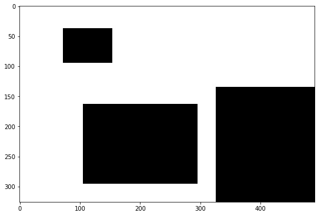
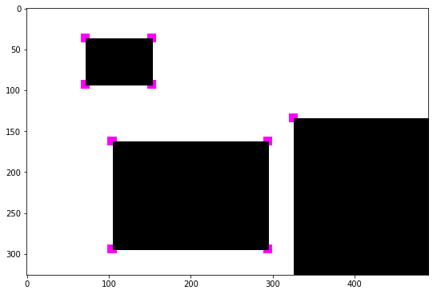
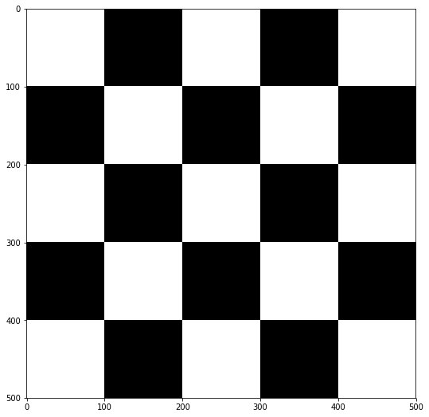
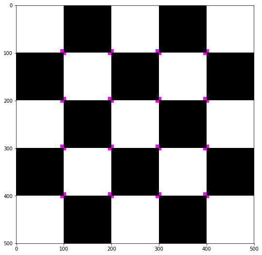
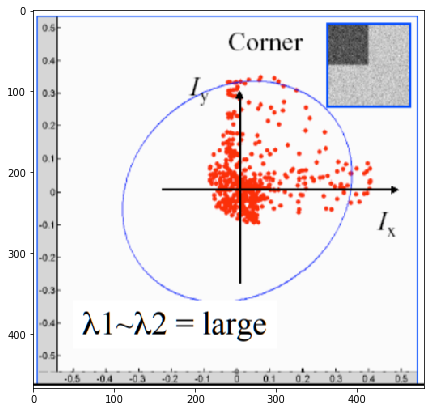
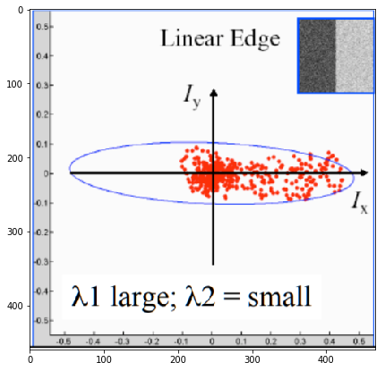
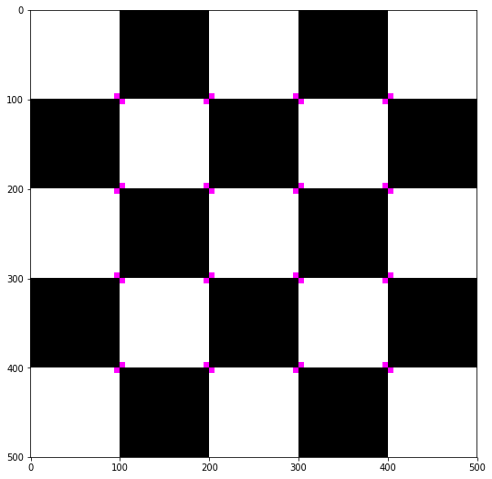
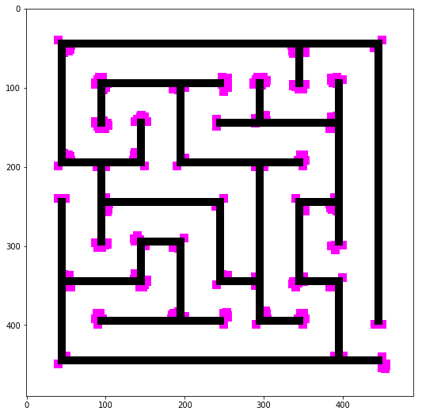

# Corner Feature Detector

Author: Pramith Devulapalli

### Corner Detector

Corners in an image are unique points that can help in a variety of tasks such as object recognition and category recognition. A corner has multiple definitions A corner can be defines as the intersection of two edges. It can also be defined as a point with two dominant and different edge directions. 

A common definition used for a corner is that a corner has very low self-similarity with neighboring image patches. This can also be termed as correlation. An image patch that has a high correlation with surrounding image patches usually indicates that a corner is not present.

Another analogous definition is the sum of squared differences. This tests the dissimilarity between an image patch and surrounding image patches.

$$SSD(u,v) = \sum_{x} \sum_{y} w(u,v)(I(x + u, y + v) - I(u, v))^2$$

By computing this metric and setting a certain threshold, one can detect corners in an edge. 

The primary drawback with the sum of squared differences formula is it is computationally very expensive and not completely optimal. 

In this notebook, I demonstrate first my own version of sum of squared differences that is much less computationally expensive, the sum of squared differences corner detector, and the Harris operator for corner detection. 


```python
# Import all relevant python modules
# OpenCV is used for image processing
import numpy as np
import matplotlib.pyplot as plt
%matplotlib inline
import scipy as sc
import scipy.misc as misc
import cv2
import math
```

### Customized Corner Edge Detector

My customized version of sum of squared differences differs with the actual formula in the sense that the surrounding pixels of a center pixel are compared. Instead of comparing two neighboring image patches, I compared neighboring pixels solely to the center pixel. So I calculated the sum of squared differences of the neighboring pixels as compared to the center pixel. This operation is much less computationally expensive, and it still retains a high level of performance. The mathematical description of my corner edge detector can be summarized through the formula below:
$$SSD(x,y) = \sum_{u} \sum_{v} w(x,y)(I(x + u, y + v) - I(x, y))^2$$


```python
# Two Dimensional Gaussian function
def TwoD_gaussian_function(x,y,sigma,mean):
    return (1./(2.*np.pi*sigma**2))*np.exp(-1*(((x-mean)**2 + (y-mean)**2)/(2.*sigma**2)))

# Gaussian kernel 
def gaussian_kernel(n):
    sigma = math.ceil(n/2)/3
    mean = math.floor(n/2)
    gauss = np.ones((n,n),np.float64)
    for i in range(0, n):
        for j in range(0, n):
            gauss[i,j] = TwoD_gaussian_function(j,i,sigma,mean)
    return gauss

# The zero padding function pads 0s around the original image so that the box filter can operate the kernel on edge pixels 
def zero_padding(image, kernel):
    array = np.zeros((image.shape[0]+kernel.shape[0]-1, image.shape[1]+kernel.shape[1]-1), np.float64)
    row1 = int((kernel.shape[0]-1)/2)
    row2 = int(row1 + image.shape[0])
    col1 = int((kernel.shape[1]-1)/2)
    col2 = int(col1 + image.shape[1])
    array[row1:row2,col1:col2] = image
    return array

# The box filer is a basic linear filter that takes the 
def greyscale_blur_filter(image, kernel):
    x1 = int((kernel.shape[0] - 1)/2)
    x2 = int(x1 + image.shape[0])
    y1 = int((kernel.shape[1] - 1)/2)
    y2 = int(y1 + image.shape[1])
    array = zero_padding(image, kernel)
    arrayOut = np.zeros(image.shape, dtype=np.uint8)
    for x in range(x1, x2):
        for y in range(y1, y2):
            xOrig = x-(kernel.shape[0]-1)/2
            yOrig = y-(kernel.shape[1]-1)/2
            multiply = array[int(xOrig):int(xOrig+kernel.shape[0]),int(yOrig):int(yOrig+kernel.shape[1])]
            replace = np.multiply(multiply, kernel)
            arrayOut[x-x1,y-y1] = int(np.sum(replace))
        
    return arrayOut


def repeat_edge_pixels(image, kernel):
    array = np.zeros((image.shape[0]+kernel.shape[0]-1, image.shape[1]+kernel.shape[1]-1), np.float64)
    row1 = int((kernel.shape[0]-1)/2)
    row2 = int(row1 + image.shape[0])
    col1 = int((kernel.shape[1]-1)/2)
    col2 = int(col1 + image.shape[1])
    array[row1:row2,col1:col2] = image
    for x in range(row1+1, row2):
        array[x, 0:col1+1] = array[x,col1]
        array[x, col2-1:] = array[x,col2-1]
        
    for y in range(col1+1, col2):
        array[0:row1+1, y] = array[row1,y]
        array[row2:,y] = array[row2-1,y]
    
    array[0:row1+1, 0:col1+1] = array[row1,col1]
    array[row2-1:, col2-1:] = array[row2-1,col2-1]
    array[0:row1+1, col2-1:] = array[row1, col2-1]
    array[row2-1:, 0:col1+1] = array[row2-1,col1]
    
    return array
    
def auto_correlation_center(pixels):
    average_pixel = pixels.mean()
    ave = pixels - average_pixel
    magnitude = np.sum(np.abs(ave))
    if magnitude==0:
        normalized_pixels = ave
    else:
        normalized_pixels = ave/magnitude
    center = np.zeros(normalized_pixels.shape)
    center[:,:] = normalized_pixels[int((pixels.shape[0]-1)/2),int((pixels.shape[1]-1)/2)]
    difference = normalized_pixels-center
    return np.sum(np.multiply(difference, difference))

def auto_correlation_center_norm(pixels):
    center = pixels[int((pixels.shape[0]-1)/2),int((pixels.shape[1]-1)/2)]
    max_diff = 0;
    if center > 127.5:
        max_diff = center
    else:
        max_diff = 255 - center
    normalization = 8*(max_diff**2)
    center_arr = np.zeros(pixels.shape)
    center_arr[:,:] = center
    diff = pixels - center
    return np.sum(np.multiply(diff,diff))/normalization
    
def corner_detection_center(img, kernel, thresh):
    #image = greyscale_blur_filter(img, gaussian_kernel(3))
    image = repeat_edge_pixels(img, kernel)
    ac = np.zeros(img.shape)
    x1 = int((kernel.shape[0] - 1)/2)
    x2 = int(x1 + img.shape[0])
    y1 = int((kernel.shape[1] - 1)/2)
    y2 = int(y1 + img.shape[1])
    for x in range(x1, x2):
        for y in range(y1, y2):
            xOrig = x-(kernel.shape[0]-1)/2
            yOrig = y-(kernel.shape[1]-1)/2
            multiply = image[int(xOrig):int(xOrig+kernel.shape[0]),int(yOrig):int(yOrig+kernel.shape[1])]
            new_val = auto_correlation_center_norm(multiply)
            threshold = thresh
            new_val = new_val - threshold
            if new_val <= 0:
                ac[x-2,y-2] = 0
            else:
                ac[x-2,y-2] = 255
    
    return ac

def mark_corners(threed_image, image):
    out = threed_image
    a = np.where(image>224)
    for x in range(0, len(a[0])):
        xx = a[0][x]
        yy = a[1][x]
        out[xx-5:xx+6, yy-5:yy+6, 1] = 0
    return out

```


```python
img = cv2.imread('RectangleCorner.jpg', 0)  # Greyscale image
img3 = cv2.imread('RectangleCorner.jpg', 1)
plt.figure(figsize=(9,9))
plt.imshow(img, cmap='gray')
```


    <matplotlib.image.AxesImage at 0x22223d43780>





```python
ag=corner_detection_center(img, np.ones((3,3)), 0.4)
ch = mark_corners(img3, ag)
plt.figure(figsize=(9,9))
plt.imshow(ch)
```


    <matplotlib.image.AxesImage at 0x2222409a898>





```python
colorchecker = cv2.imread('Checkerboard.png', 1)  # Color image
checker = cv2.imread('Checkerboard.png', 0)  # Greyscale image
cv2.imshow('image', colorchecker)
cv2.waitKey(0)
cv2.destroyAllWindows()
plt.figure(figsize=(9,9))
plt.imshow(checker, cmap='gray')
```


    <matplotlib.image.AxesImage at 0x222256d9dd8>





```python
checkerboard = corner_detection_center(checker, np.ones((3,3)), 0.45)
#cv2.imshow('image', checkerboard)
#cv2.waitKey(0)
#cv2.destroyAllWindows()
c = mark_corners(colorchecker, checkerboard)
plt.figure(figsize=(9,9))
plt.imshow(c)
```


    <matplotlib.image.AxesImage at 0x175100b66a0>





### Harris Detector

The harris corner detector is a commonly used technique in computer vision to detect corners in a wide variety of images. Computing the sum of squared differences or alternatively the normalized cross correlation coefficient are computationally expensive procedures that process images for long amounts of time. The harris corner detector utilizes Taylor expansions and eigenvalue decomposition to detect potential corners in an image in substitute of the sum of squared differences and cross correlation method.

As noted above, the sum of squared differences formula is reprinted below:
$$E(u,v) = \sum_{x} \sum_{y} w(u,v)(I(x + u, y + v) - I(u, v))^2$$
$w(u,v) = $ window function, can be used to implement blurring on the window at position u,v or simply act like a mask such that the specified window at u, v is only used $$$$
$x, y = $ displacement from the original image patch at u, v $$$$
$I(u, v) = $ intensity at the position u, v $$$$
$I(x+u, y+v) = $ intensity of the image at the shifted point by (x,y)

Implementing this summation can be quite expensive. Instead, one can approximate $I(x+u,y+v)$ with a taylor expansion. The general form of the taylor expansion follows below:
$$f(x) = f(a) + f^{'}(a)(x-a) + \frac{f^{''}(a)}{2!} +  ...$$
Limiting the taylor expansion to the first order, $I(x+u, y+v)$ can be expressed as
$$I(x, y) + uf_x(x, y) + vf_y(x, y) $$
Substituting this into the original sum of squared differences formula, 
$$ \approx \sum_{x,y}(I(x,y) + uI_x + vI_y - I(x, y))^2 $$
and this can be further simplified into 
$$ = \sum_{x,y} \begin{bmatrix} u & v \end{bmatrix} \begin{bmatrix} I_x^2 & I_xI_y \\ I_xI_y & I_y^2 \end{bmatrix} \begin{bmatrix} u \\ v \end{bmatrix}$$

M is called the structure tensor and represents the following quantity: 
$$\sum_{x,y} \begin{bmatrix} I_x^2 & I_xI_y \\ I_xI_y & I_y^2 \end{bmatrix}$$

Recall that an edge can be defined as being dissimilar to neighboring image patches. Alternatively, an edge can also be defined as having two dominant gradients in differing directions (SSD would produce a large value thus showing dissimilarity). If a sample image had one corner, the gradient at each pixel was calculated in the x and y directions, and the derivatives were graphed on a plot, it would look like the following plot:


```python
ellipse = cv2.imread('ellipse.png', 1)
ellipse2 = cv2.imread('ellipse2.png', 1)
plt.figure(figsize=(7,7))
plt.imshow(ellipse)
```


    <matplotlib.image.AxesImage at 0x1750221f550>





A graphical representation of the derivatives can be represented by an ellipse centered at the origin with major axis and minor axis of the ellipse determined by the magnitude of the image derivatives in both the x and y directions. For a picture with only a linear edge, the corresponding graph would be represent a narrow ellipse. 


```python
plt.figure(figsize=(7,7))
plt.imshow(ellipse2)
```


    <matplotlib.image.AxesImage at 0x17502276080>





For a picture with no edges and a flat surface, the ellipse would be tiny and look like a circle with a small radius. Qualitatively speaking, one could decipher if there was a corner in an image by taking the gradient of an image patch, graphing the derivative magnitudes, and if the ellipse is considerably large than a point can be inferred. Mathematically, performing eigenvalue decomposition on the structure tensor M can yield two different eigenvalues that represent the major axis and minor axis of the ellipse. If both eigenvalues are large, then the specified image patch can be inferred to have a point. 

However, eigenvalue decomposition is a non-trivial operation that takes some computational power to compute. This computation can slow down the process, so an alternative approach is calculate the harris response:
$$ R = Det(M) - k(Trace(M))^2\:\:\: k\:is\:a \:an \:empirically \:determined \:constant \:between \:0.4-0.6 $$

The trace of a sum is defined as the sym of the elements in the main diagonal of a square matrix. Depending on the magnitude of R, a particular image patch can be assessed to potentially have a corner. Placing a threshold value on R is the primary method for corner detection.

Procedure:
1. Gaussian blur the image to remove high frequency noise
2. Compute the gradient at every pixel on the image in the x and y directions using the Sobel operators. 
3. For each pixel with a specified window size, calculate the structure tensor M by using the gradient calculations found in step 2.
4. Compute the reponse of the detector at each pixel.
5. Place a threshold value on R.
6. Use non-maximum suppresion to only yield locally maximum responses values.


```python
def nonmaximum_suppresion(pixels):
    if pixels.max()==pixels[1,1]:
        return pixels[1,1]
    else:
        return 0

def Harris_corner_detector(img, thresh):
    # Apply gaussian filter on the image with a 3x3 kernel
    #image = greyscale_blur_filter(img, gaussian_kernel(5))
    image = img
    gradient_x = np.zeros((image.shape[0]-1, image.shape[1]-1))
    gradient_y = np.zeros((image.shape[0]-1, image.shape[1]-1))
    gradient_xy = np.zeros((image.shape[0]-1, image.shape[1]-1))
    sobel_x = np.array([[-1,0,1],[-2,0,2],[-1,0,1]])
    sobel_y = np.array([[1,2,1],[0,0,0],[-1,-2,-1]])
    response = np.zeros(img.shape)
    output = np.zeros(img.shape)
    
    for x in range(1, image.shape[0]-1):
        for y in range(1, image.shape[1]-1):
            multiply = image[int(x-1):int(x+2),int(y-1):int(y+2)]
            x_grad = np.sum(np.multiply(multiply, sobel_x))
            y_grad = np.sum(np.multiply(multiply, sobel_y))
            gradient_x[x-1, y-1] = x_grad*x_grad
            gradient_y[x-1, y-1] = y_grad*y_grad
            gradient_xy[x-1, y-1] = x_grad*y_grad
            
    for x in range(2, image.shape[0]-2):
        for y in range(2, image.shape[1]-2):
            multiply_x = gradient_x[int(x-2):int(x+1), int(y-2):int(y+1)]
            multiply_y = gradient_y[int(x-2):int(x+1), int(y-2):int(y+1)]
            multiply_xy = gradient_xy[int(x-2):int(x+1), int(y-2):int(y+1)]
            sum_x = np.sum(np.multiply(multiply_x, multiply_x))
            sum_y = np.sum(np.multiply(multiply_y, multiply_y))
            sum_xy = np.sum(multiply_xy)
            R = (sum_x*sum_y - sum_xy*sum_xy) - 0.06*(sum_x + sum_y)**2
            threshold = thresh
            value = R - threshold
            if value < 0:
                response[x,y] = 0
            else:
                response[x,y] = value
            
    for x in range(2, image.shape[0]-2):
        for y in range(2, image.shape[1]-2):
            output[x,y] = nonmaximum_suppresion(response[int(x-1):int(x+2), int(y-1):int(y+2)])
    return output
```


```python
test = Harris_corner_detector(checker, 1000)
checker_corners = mark_corners(colorchecker, test)
plt.figure(figsize=(9,9))
plt.imshow(checker_corners)
```


    <matplotlib.image.AxesImage at 0x222256f9e10>





```python
maze = cv2.imread('maze.jpg', 0)
maze3 = cv2.imread('maze.jpg', 1)
m = Harris_corner_detector(maze, 200000)
maze_corners = mark_corners(maze3, m)
plt.figure(figsize=(9,9))
plt.imshow(maze_corners)
```


    <matplotlib.image.AxesImage at 0x1751010bba8>




