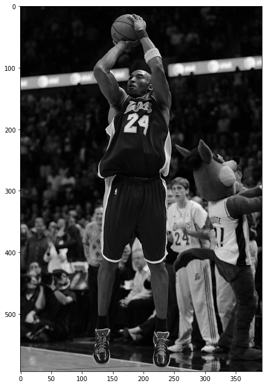
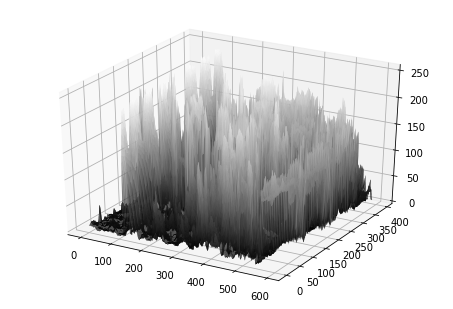
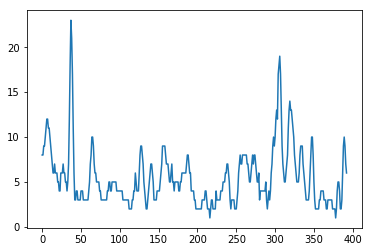
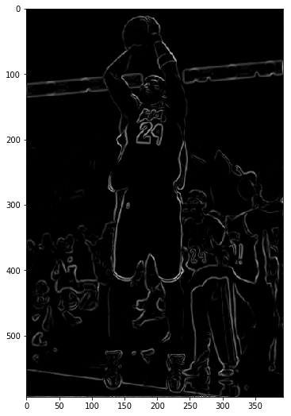
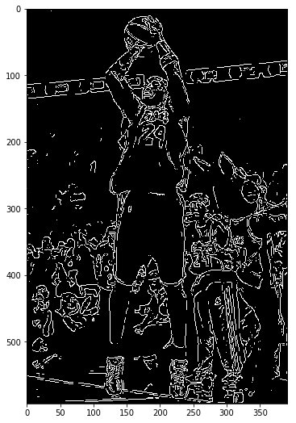

# Edge Detector

Author: Pramith Devulapalli


```python
# Import all relevant python modules
# OpenCV is used for image processing
#from mpl_toolkits import mplot3d
import numpy as np
import matplotlib.pyplot as plt
%matplotlib inline
import scipy as sc
import scipy.misc as misc
import cv2
import math
from mpl_toolkits.mplot3d import axes3d, Axes3D
```


```python
img = cv2.imread('Kobe jump shot.jpg', 0)  # Greyscale image
plt.figure(figsize=(11,11))
plt.imshow(img, cmap='gray')
```


    <matplotlib.image.AxesImage at 0x97efccfcc0>





Edges are defined as a sharp contrast between two boundaries. The idea behind edge detection is find the large gradients in the intensity of the image and define edges as those sharp changes in intensity. 

For example, the below figure is a surface plot of the varying intensities of the Kobe jump shot image. 


```python
xx, yy = np.mgrid[0:img.shape[0], 0:img.shape[1]]
fig = plt.figure()
ax = Axes3D(fig)
ax.plot_surface(xx, yy, img, cmap=plt.cm.gray, rstride = 1, cstride = 1)
plt.show()
```





#### How are edges detected in an image?

The concept of an edge is a contrast between the intensity variation in the image. Looking at the graph below and plotting the intensity of the image for one row, rapid changes occur at  and . These are not necessarily edges, but rather potential to be flagged as edges.


```python
def gradient(img):
    cols = img.shape[1]-1
    image_gradient = np.zeros((1, cols), np.int)
    for i in range(0, cols):
        image_gradient[0,i] = int(img[0,i+1]) - int(img[0,i])
    return image_gradient

grad = gradient(img)
plt.plot(img[0,:])
```


    [<matplotlib.lines.Line2D at 0x97e037d438>]





Taking the first derivative of the image would yield the graph below. The points of interest at  and  yield local maximums and local minimums in the graph. If the second derivative of the image was plotted, one would notice that the local maximums and local minimums in the first derivative would be zero crossings in the second derivative. So, from a preliminary perspective, potential edges can be detected by finding the zero crossings in the second derivative.


```python
plt.plot(grad[0,:])
```


    [<matplotlib.lines.Line2D at 0x97ef90b278>]


With this raw definition of edge detection, there are glaring problems that need to be addressed. Looking at the original graph and the graph's derivative, there seem to be multitudes of zero crossings in the graph that correspond to edges. But is that correct? Below is a slice of the image where the very top row is graphed. The top row is completely black, so there shouldn't be any edges detected but from raw computation, one would falsely detect many edges.


```python
plt.imshow(img[0:20,:])
```


    <matplotlib.image.AxesImage at 0x97d0137908>


One of the glaring problems is that image is quite noisy. The noisiness of the image increases drastically as the derivative of the graph is taken. Additionally, the graphs have very many rigid steps that gives way to the ragged look of the graphs. This is mostly due to the fact that pixels exist at discrete levels. Also, how can we verify that the edge detected is truly an edge? In this case, as long as a zero crossing is detected, an edge is being flagged. This is not an optimal situation because a zero crossing in the second derivative may not correspond to maxima or minima in the first derivative that is large enough in magnitude to be called an edge. 

#### How do we solve these problems?

The way to combat this is to smoothen the image such that the discrete valued image becomes "continuous" through a smoothing filter. Additionally, running a low pass filter removes the high frequency component that gives rise to these large number of ragged peaks and troughs seen in the derivative graph above. The typical filter to perform this operation is the Gaussian filter. 
 
Additionally, setting a threshold value for detecting an edge is beneficial for removing false positive. If the magnitude of the maxima or minima is above the threshold, then flag that area of the image as an edge. 

#### My Approach to Edge Detection

1. Smooth the image with a 5x5 gaussian kernel
2. Run a for loop to go through all the rows and for each row produce a 5th order spline 
3. Find the roots of the second derivative of the spline
4. Extract the values of those roots in the first derivative and compare them to a threshold.
5. Add the pixel as an edge if the value is above the threshold. 
6. Repeat the same process for all the columns of the image. 
7. Compile the edges found in the horizontal and vertical directions of the image 
8. Output the result


```python
# Blurring filter for greyscale images added to produce a gaussian filtered image
# The zero padding function pads 0s around the original image so that the box filter can operate the kernel on edge pixels 
def zero_padding(image, kernel):
    array = np.zeros((image.shape[0]+kernel.shape[0]-1, image.shape[1]+kernel.shape[1]-1), np.float64)
    row1 = int((kernel.shape[0]-1)/2)
    row2 = int(row1 + image.shape[0])
    col1 = int((kernel.shape[1]-1)/2)
    col2 = int(col1 + image.shape[1])
    array[row1:row2,col1:col2] = image
    return array

# The box filer is a basic linear filter that takes the 
def greyscale_blur_filter(image, kernel):
    x1 = int((kernel.shape[0] - 1)/2)
    x2 = int(x1 + image.shape[0])
    y1 = int((kernel.shape[1] - 1)/2)
    y2 = int(y1 + image.shape[1])
    array = zero_padding(image, kernel)
    arrayOut = np.zeros(image.shape, dtype=np.uint8)
    for x in range(x1, x2):
        for y in range(y1, y2):
            xOrig = x-(kernel.shape[0]-1)/2
            yOrig = y-(kernel.shape[1]-1)/2
            multiply = array[int(xOrig):int(xOrig+kernel.shape[0]),int(yOrig):int(yOrig+kernel.shape[1])]
            replace = np.multiply(multiply, kernel)
            arrayOut[x-x1,y-y1] = int(np.sum(replace))
        
    return arrayOut

# Two Dimensional Gaussian function
def TwoD_gaussian_function(x,y,sigma,mean):
    return (1./(2.*np.pi*sigma**2))*np.exp(-1*(((x-mean)**2 + (y-mean)**2)/(2.*sigma**2)))

# Gaussian kernel 
def gaussian_kernel(n):
    sigma = math.ceil(n/2)/3
    mean = math.floor(n/2)
    gauss = np.ones((n,n),np.float64)
    for i in range(0, n):
        for j in range(0, n):
            gauss[i,j] = TwoD_gaussian_function(j,i,sigma,mean)
    return gauss

# Apply a 5x5 Gaussian kernel to Gaussian filter the image
# Create a spline for the horizontal and vertical components of the image pixel values
# Take the second derivative of every spline. 
# Get the zero crossings by getting the roots of the function. 
# Set a threshold the illuminates edges such that the gradient magnitude of the roots is large enough
def edge_detection(img):
    image = greyscale_blur_filter(img, gaussian_kernel(5))
    #image = img
    gradient_x = np.zeros(img.shape)
    gradient_y = np.zeros(img.shape)
    # Horizontal Part
    for x in range(0, image.shape[0]):
        sp_x = np.arange(0, image.shape[1])
        sp_y = image[x,:]
        spline = sc.interpolate.UnivariateSpline(sp_x, sp_y, k = 5)
        roots = spline.derivative(n=2).roots()
        spline_derivative = spline.derivative(n=1)
        threshold = 10
        mArray = np.absolute(spline_derivative(sp_x)) - threshold
        mArray[mArray < 0.1] = 0
        gradient_x[x, 0:image.shape[1]] = mArray
        
    for y in range(0, image.shape[1]):
        sp_x = np.arange(0, image.shape[0])
        sp_y = image[:,y]
        spline = sc.interpolate.UnivariateSpline(sp_x, sp_y, k = 5)
        roots = spline.derivative(n=2).roots()
        spline_derivative = spline.derivative(n=1)
        threshold = 10
        mArray = np.absolute(spline_derivative(sp_x)) - threshold
        mArray[mArray < 0.1] = 0
        gradient_y[0:image.shape[0],y] = mArray
    
    edges = gradient_x + gradient_y
    return edges

test = edge_detection(img)
#cv2.imshow('image', test)
#cv2.waitKey(0)
#cv2.destroyAllWindows()
plt.figure(figsize=(9,9))
plt.imshow(test, cmap='gray')
```


    <matplotlib.image.AxesImage at 0x97efc9f630>





### Canny Edge Detection

The Canny Edge detection algorithm is widely used edge detector in many computer vision applications. In the following section, I will implement this edge detector from scratch not using any OpenCV implementations. 

Procedure:
1. Smooth the image with a gaussian filter.
2. Compute the gradient using the finite-difference kernel. The key is to calculate the magnitude of the gradient and the angle of the gradient.
3. Apply the nonmaxima supression to the gradient magnitude in the direction of the gradient to thin the edges
4. Use the double thresholding algorithm to detect edges and build contours.

Gradient:
The gradient of the image is simply a vector derivative of the x and y position of the pixel. Since the canny edge detector does not simplify the image into 1-d arrays like the spline-based edge detection approach, the image will be treated as a three dimensional function and computing the first derivative of the image is synonymous to calculating the gradient of the image. Normally, zero crossings in the second derivative correspond to edges, but the gradients at every pixel points in the direction of steepest ascent. So, by following the gradient, one can locate local maxima and minima using the first derivative itself. 


Finite-Difference Kernel:
The sobel x and y operators are used to compute the gradient of a certain pixel by taking a horizontal derivative and a vertical derivative. Once the sobel operators have been applied to the image patch, the x gradient and the y gradient is computed, and the angle using the gradients is calculated to find the direction of the gradient in the steepest ascent/descent. 

Nonmaxima-suppresion:
The idea behind nonmaxima suppresion is to thin the edges seen in the image by setting a pixel value 0 if along the direction of the gradient it is not the maxima value. 

Double thresholding: 
Double thresholding is used to remove edges that hit a certain threshold value. The ideas is to have two thresholds, with one threshold twice the other. The image with a higher threshold will have less edges while the image with a lower threshold will have more contours. The idea is to connect the edges in the higher threshold image by looking at the lower threshold.


```python
sobel_x = (1/3.)*np.array([[-1,0,1],[-2,0,2],[-1,0,1]])
sobel_y = (1/3.)*np.array([[1,2,1],[0,0,0],[-1,-2,-1]])

def tangent_angle(y, x):
    ang = math.degrees(math.atan2(y,x))
    if ang < 0:
        return 360.0 + ang
    else:
        return ang
    
def sector_angle(angle):
    sectors = np.array([337.5, 22.5, 67.5, 112.5, 157.5, 202.5, 247.5, 292.5])
    sectors2 = np.array([3,0,1,2,3,0,1,2])
    value = 0
    if angle<337.5:
        test = sectors-angle
        value = sectors2[np.where((test<45) & (test>=0))[0]][0]
    return value
    
def nonmaxima_supression(pixels, sect):
    if sect == 0:
        vals = pixels[1,0:3]
        if vals.max() != pixels[1,1]:
            return 0
        else:
            return pixels[1,1]
    elif sect == 1:
        vals = np.array([pixels[2,0],pixels[1,1],pixels[0,2]])
        if vals.max() != pixels[1,1]:
            return 0
        else:
            return pixels[1,1]
    elif sect == 2:
        vals = pixels[0:3, 1]
        if vals.max() != pixels[1,1]:
            return 0
        else:
            return pixels[1,1]
    else:
        vals = np.array([pixels[0,0],pixels[1,1],pixels[2,2]])
        if vals.max() != pixels[1,1]:
            return 0
        else:
            return pixels[1,1]
        
    
def Canny_edge_detection(img):
    image = greyscale_blur_filter(img, gaussian_kernel(5))
    gradient = np.zeros((image.shape[0]-1, image.shape[1]-1))
    angles = np.zeros((image.shape[0]-1, image.shape[1]-1))
    
    for x in range(1, image.shape[0]-1):
        for y in range(1, image.shape[1]-1):
            multiply = img[(x-1):(x+2),(y-1):(y+2)]
            x_grad = np.sum(np.multiply(multiply, sobel_x))
            y_grad = np.sum(np.multiply(multiply, sobel_y))
            grad = np.sqrt(x_grad**2 + y_grad**2)
            angle = tangent_angle(y_grad, x_grad)
            gradient[x-1,y-1] = grad
            angles[x-1,y-1] = angle
    
    output = zero_padding(gradient, np.zeros((3,3)))
    M = np.zeros(gradient.shape)
    for x in range(1, output.shape[0]-1):
        for y in range(1, output.shape[1]-1):
            kernel = output[(x-1):(x+2),(y-1):(y+2)]
            sector_val = sector_angle(angles[x-1,y-1])
            new_val = nonmaxima_supression(kernel, sector_val)
            threshold = 31
            if ((new_val - threshold) < 0):
                M[x-1,y-1] = 0
            else:
                M[x-1,y-1] = 255
    return M


kobe = Canny_edge_detection(img)
plt.figure(figsize=(9,9))
plt.imshow(kobe, cmap='gray')
```


    <matplotlib.image.AxesImage at 0x97cf639e48>





```python

```
